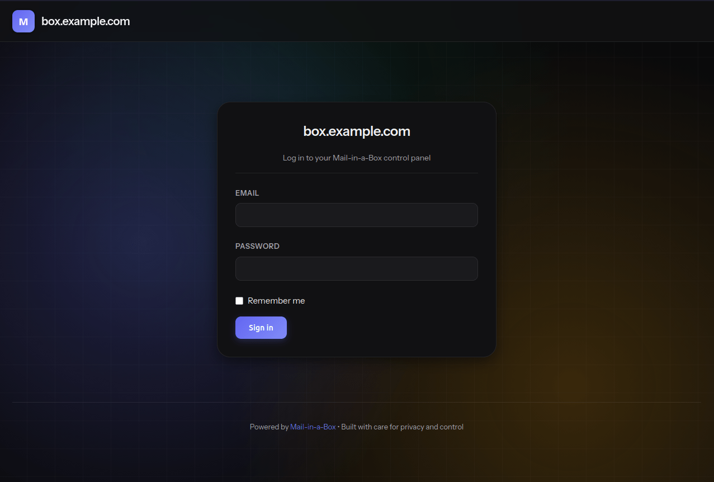

<div align="center">
  <h1>Mail-in-a-Box</h1>
  
  <br>
  <p>A modern self-hosted mail server stack. Fork of <a href="https://github.com/mail-in-a-box/mailinabox">Mail-in-a-Box</a>.</p>
  <p>By <a href="https://github.com/boomboompower">boomboompower</a> and <a href="https://github.com/boomboompower/mailinabox/graphs/contributors">contributors</a>.</p>
  <p>
    <a href="LICENSE"></a>
    <a href="https://ubuntu.com/"></a>
  </p>
</div>

---

> **Archived branch: the Python-era fork.**
>
> This branch (`python-legacy`) is a frozen snapshot of the fork's complete
> Python/Flask management system, preserved as a middle ground between
> upstream Mail-in-a-Box and the Go rewrite that replaced it on `main`.
>
> - It is fully functional as of its last commit: Python management daemon,
>   Vue 3 admin panel, rspamd, Dovecot 2.4, Docker deployment, and the rest.
> - It contains no Go code and has no Go toolchain requirement anywhere.
> - It is **unsupported and receives no updates**. Install fixes may be
>   accepted; features will not be backported.
>
> For the actively developed system, use the `main` branch.

---

## Table of contents

- [Why](#why)
- [What changed from upstream](#what-changed-from-upstream)
- [What is in the box](#what-is-in-the-box)
- [Requirements](#requirements)
- [Quick start](#quick-start)
- [API](#api)
- [Contributing](#contributing)
- [Security](#security)
- [Acknowledgements](#acknowledgements)
- [License](#license)

---

## Why

This project is a fork of [Mail-in-a-Box](https://github.com/mail-in-a-box/mailinabox) with a different set of component
choices. The PHP-based webmail and groupware stack has been replaced with oxi.email (Rust), FileBrowser, and Radicale.
The admin panel has been rewritten in Vue 3 with WebAuthn support added. A Docker deployment path sits alongside the
existing bare metal installer. The mail core - Postfix, Dovecot, NSD - is unchanged.

Our goals:

- Self-hosted email that is simple to deploy and understand
- Promote [decentralization](http://redecentralize.org/) and privacy on the web
- Configuration that is automated, auditable, and [idempotent](https://en.wikipedia.org/wiki/Idempotence)
- Modern auth: TOTP, passkeys (WebAuthn), and hardware security keys

## What changed from upstream

| Area           | Upstream MIAB      | This Fork                                                               |
|----------------|--------------------|-------------------------------------------------------------------------|
| Webmail        | Roundcube (PHP)    | [oxi.email](https://github.com/boomboompower/oxi-miab) (Rust, prebuilt) |
| File storage   | Nextcloud (PHP)    | [FileBrowser](https://filebrowser.org/) (Go)                            |
| CalDAV/CardDAV | Nextcloud          | [Radicale](https://radicale.org/) (Python)                              |
| Mobile sync    | Z-Push (PHP)       | Native IMAP/CalDAV/CardDAV clients                                      |
| Admin UI       | jQuery + Bootstrap | Vue 3 + TypeScript                                                      |
| Admin auth     | Password / TOTP    | Password + TOTP + WebAuthn passkeys                                     |
| Ubuntu target  | 22.04 LTS          | 22.04 LTS / 24.04 LTS / 26.04 LTS                                       |
| Deployment     | Bare metal only    | Bare metal + Docker                                                     |
| PHP            | Required           | Not installed                                                           |
| Backups        | Duplicity          | [Restic](https://github.com/restic/restic) / Duplicity                  |
| Relay support  | No                 | Yes (configurable in admin panel)                                       |

This is a hard-fork, and has diverged significantly from the original codebase. Given it has diverged
signicantly from upstream, fixes from upstream will be ported manually on a case-by-case basis.

## What is in the box

Mail-in-a-Box turns a fresh Ubuntu machine into a working mail server by installing and configuring:

### Mail

- SMTP ([Postfix](http://www.postfix.org/)) and IMAP ([Dovecot](https://dovecot.org/))
- Spam filtering and greylisting ([rspamd](https://rspamd.com/) default, [SpamAssassin](https://spamassassin.apache.org/) optional)
- Mail filter rules (Dovecot Sieve) and email client autoconfig

### DNS

- Authoritative DNS ([NSD](https://nlnetlabs.nl/projects/nsd/)) with [SPF](https://en.wikipedia.org/wiki/Sender_Policy_Framework), [DKIM](https://en.wikipedia.org/wiki/DomainKeys_Identified_Mail), [DMARC](https://en.wikipedia.org/wiki/DMARC), [DNSSEC](https://en.wikipedia.org/wiki/DNSSEC), [DANE TLSA](https://en.wikipedia.org/wiki/DNS-based_Authentication_of_Named_Entities), [MTA-STS](https://tools.ietf.org/html/rfc8461), and [SSHFP](https://tools.ietf.org/html/rfc4255) records set automatically
- Local recursive resolver ([Unbound](https://nlnetlabs.nl/projects/unbound/)) with DNSSEC validation - required for DANE and for bypassing shared-IP rate limits on DNS blocklists

### Web services

- Webmail: [oxi.email](https://github.com/boomboompower/oxi-miab) (Rust, prebuilt binary, no PHP)
- Contacts and calendar sync: [Radicale](https://radicale.org/) (CardDAV/CalDAV)
- File storage: [FileBrowser](https://filebrowser.org/)
- Reverse proxy: [nginx](https://nginx.org/)

### Security and operations

- TLS certificates provisioned automatically via [Let's Encrypt](https://letsencrypt.org/)
- Brute-force protection ([fail2ban](https://www.fail2ban.org/)), firewall ([ufw](https://launchpad.net/ufw))
- Backups ([restic](https://restic.net/) default, [duplicity](https://duplicity.nongnu.org/) optional)
- System monitoring ([Munin](https://munin-monitoring.org/))
- Admin control panel with TOTP and WebAuthn passkey support

### Management

- Daily health checks: services, ports, TLS validity, DNS correctness
- Web control panel for users, aliases, DNS records, and backups
- REST API for all control panel actions

Internationalized domain names are supported. Static website hosting is included.

## Requirements

- **Ubuntu LTS** (64-bit) - 22.04, 24.04, and 26.04 are all supported
- A fresh machine - the installer prefers to own the system and _may_ overwrite existing configurations.
- A domain name with glue records pointing to the box's IP

For Docker development, any Linux host with Docker and Docker Compose installed is sufficient.

## Quick start

### boxctl - the recommended entry point

`boxctl` is the interactive setup wizard for both Docker and bare metal. It walks you through configuration, generates your `.env`, and prints the exact command to run.

```bash
git clone https://github.com/boomboompower/mailinabox
cd mailinabox
python3 setup/boxctl
```

Running with no arguments shows a landing screen: **Docker**, **Bare metal**, or **Manage services**. Skip it with a subcommand:

```bash
python3 setup/boxctl baremetal   # bare metal guided install
python3 setup/boxctl docker      # Docker setup wizard
python3 setup/boxctl update      # For updating an existing installation
python3 setup/boxctl doctor      # check service health on a running box
```

---

### Docker

boxctl generates the compose command for you. If you prefer to run manually:

```bash
cp deploy/docker/.env.example deploy/docker/.env
# edit deploy/docker/.env - set PRIMARY_HOSTNAME at minimum

# core stack only (mail, DNS, nginx, admin panel):
docker compose -f deploy/docker/docker-compose.yml up --build

# with all optional services:
docker compose -f deploy/docker/docker-compose.yml \
  --profile oxi --profile filebrowser --profile radicale --profile monitoring \
  up --build
```

Default dev ports (no root required - all overridable via `.env`):

| Service              | Dev port | Production port |
|----------------------|----------|-----------------|
| HTTP                 | 8080     | 80              |
| HTTPS                | 8443     | 443             |
| SMTP (inbound)       | 2525     | 25              |
| SMTPS                | 465      | 465             |
| SMTP submission      | 587      | 587             |
| IMAPS                | 993      | 993             |
| Sieve                | 4190     | 4190            |
| DNS (UDP/TCP)        | 5354     | 53              |

For production, overlay `docker-compose.prod.yml` to bind standard ports:

```bash
docker compose -f deploy/docker/docker-compose.yml -f deploy/docker/docker-compose.prod.yml \
  --profile oxi --profile filebrowser --profile radicale --profile monitoring \
  up --build
```

Rebuild a single container without restarting everything:

```bash
docker compose -f deploy/docker/docker-compose.yml --profile oxi up --build -d webmail
```

---

### Bare metal

Start with a completely fresh Ubuntu LTS 64-bit machine. The guided path:

```bash
git clone https://github.com/boomboompower/mailinabox
cd mailinabox
python3 setup/boxctl baremetal
```

Or run the installer directly if you already have a config:

```bash
sudo setup/install.sh
```

Re-running `sudo setup/install.sh` at any time is safe - it is fully idempotent.

## API

Every action in the control panel is available through a REST API, accessible at `https://<box>/admin/api/`.
Authenticate with HTTP Basic Auth using an admin account, or generate a dedicated API key in the control panel.

## Contributing

See [CONTRIBUTING.md](.github/CONTRIBUTING.md).

## Security

See [SECURITY.md](.github/SECURITY.md) for the full threat model. To report a vulnerability privately, use [GitHub Security Advisories](https://github.com/boomboompower/mailinabox/security/advisories/new).

## Acknowledgements

This fork of Mail-in-a-Box stands on the shoulders of giants.
This project would not exist without [Mail-in-a-Box](https://github.com/mail-in-a-box/mailinabox) by
[Joshua Tauberer](https://joshdata.me/) and its many contributors, who did the hard work of making a mail server
actually work for real people. The original project was itself inspired by the
["NSA-proof your email in 2 hours"](https://sealedabstract.com/code/nsa-proof-your-e-mail-in-2-hours/) post by
Drew Crawford and [Sovereign](https://github.com/sovereign/sovereign) by Alex Payne.

## License

This project is licensed under the [MIT License](LICENSE). It is a fork of [Mail-in-a-Box](https://mailinabox.email), which was released into the public domain under CC0 1.0 by its contributors. New contributions in this fork are MIT-licensed.
